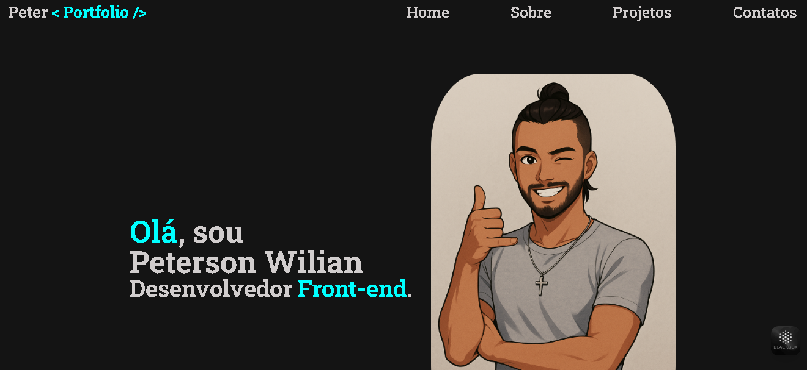

# 🚀 Portfólio Acadêmico — Peterson Wilian

Este é o meu portfólio acadêmico desenvolvido como parte da minha formação em Análise e Desenvolvimento de Sistemas. O projeto reúne informações sobre mim, minhas redes, e showcases de projetos desenvolvidos durante os estudos com HTML, CSS e JavaScript.

---

## 📌 Sobre o Projeto

O portfólio foi criado com o objetivo de:

- 📄 Apresentar uma breve biografia profissional
- 💼 Mostrar meus projetos práticos desenvolvidos em sala ou de forma autodidata
- 🔗 Centralizar minhas redes sociais de forma acessível
- 🖥️ Exercitar habilidades de desenvolvimento front-end com foco em responsividade e design limpo

---

## 🧪 Tecnologias Utilizadas

- [HTML5](w)
- [CSS3](w)
- [JavaScript](w)
- [Google Fonts](w)
- [Boxicons CDN (em alguns projetos)](w)

---

## 📁 Estrutura do Projeto

/portfolio/
├── index.html
├── style.css
├── /img/
│ ├── avatar1.png
│ ├── avatar.png
│ ├── cafeteria.PNG
│ ├── tela.PNG
│ ├── calculadora.PNG
│ └── portfolio.PNG

---

## 📸 Projetos Apresentados

| Projeto            | Descrição |
|--------------------|-----------|
| **Cafeteria**       | Landing page moderna com vídeo de fundo e modal interativo. |
| **Tela de Login**   | Interface responsiva e estilizada com ícones via CDN. |
| **Calculadora**     | Aplicação funcional desenvolvida com HTML, CSS e JS. |
| **Página de Portfólio** | Projeto atual, com layout limpo e responsivo, feito com HTML e CSS puro. |

---

## 🧑‍💻 Autor

**Peterson Wilian Martins**

- 🌍 [LinkedIn](https://www.linkedin.com/in/petersonwilian)
- 💻 [GitHub](https://github.com/PetersonwilianMartins)
- 📷 [Instagram](https://www.instagram.com/Peterso_wilian)
- 📧 Email: peter.wilian.martins@hotmail.com

---

## 📝 Licença

Este projeto foi desenvolvido para fins acadêmicos e de aprendizado. Fique à vontade para clonar, estudar e personalizar.

---

